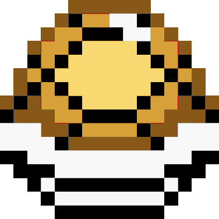

 
 

  <h1>What it is?</h1>
  <h3>Project carried out using construction in HTML, CSS styling and interaction with Javascript. Hope you like it!</h3>
  <h1>How to Play?</h1>
   <h3>Press any key to jump. If you bump into the turtle shell, the game is over!</h3>
  

